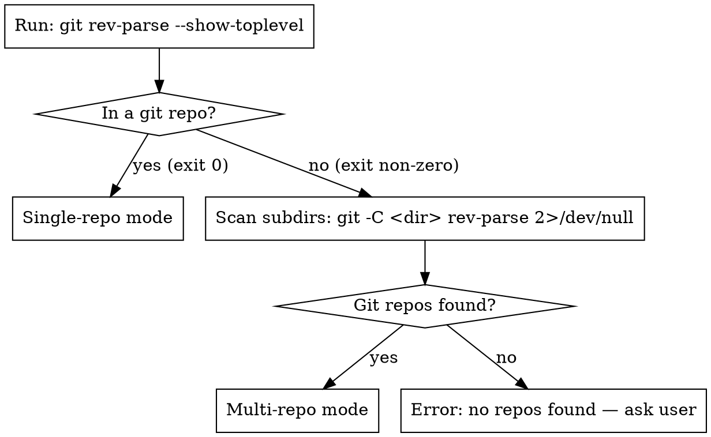

# Sandboxed Implementation Environment Design

**Goal:** Run Claude Code implementation sessions in an isolated Docker container with full tool autonomy, no permission prompts, and no blast radius on the host OS.

**Drivers:**
- Constant permission prompts during `executing-plans` sessions create friction
- Giving blanket permissions on the host OS is a security risk
- Implementation sessions should be fire-and-forget: start, get a PR, review it

---

## Architecture Overview

```
sandbox.sh <plan-path>
  │
  ├─ reads: ANTHROPIC_API_KEY, GITHUB_TOKEN (from shell env)
  ├─ creates: ~/.claude/sandbox-logs/<timestamp>-<topic>.log
  ├─ starts Docker container
  │     ├─ env: ANTHROPIC_API_KEY, GITHUB_TOKEN, REPO_URL, BASE_BRANCH,
  │     │       FEATURE_BRANCH, PLAN_PATH
  │     ├─ volume: log file (write-only)
  │     └─ network: full outbound internet
  │
  └─ after container exits:
        ├─ parses log for token/cost summary
        ├─ appends record to ~/.claude/sandbox-costs.csv
        └─ prints "DONE: <pr-url> | Cost: $X.XX"
```

The container is sealed except for: outbound network and a single write-only log file. Host filesystem, SSH keys, credentials — invisible to it.

---

## Deliverable 1: Brainstorming Skill Enhancement

**File:** `skills/brainstorming/SKILL.md`

### Plan Placement Rule

Added to the checklist between "Write design doc" and "Transition to implementation":

**Detect repo context before saving any plan:**



**Iron law:** A plan for repo X is ALWAYS saved inside repo X. Never at the root, never inside another repo.

**In multi-repo mode:** only create plans for repos the feature actually touches. Do not create empty plans for uninvolved repos.

---

## Deliverable 2: writing-plans Skill Enhancement

**File:** `skills/writing-plans/SKILL.md`

### Extended Plan Header

Every plan header gains three new fields, populated automatically:

```markdown
# [Feature Name] Implementation Plan

> **For Claude:** REQUIRED SUB-SKILL: Use superpowers:executing-plans to implement this plan task-by-task.

**Goal:** [One sentence describing what this builds]
**Architecture:** [2-3 sentences about approach]
**Tech Stack:** [Key technologies/libraries]
**Repo:** [output of: git remote get-url origin]
**Base Branch:** [output of: git symbolic-ref refs/remotes/origin/HEAD | sed 's@^refs/remotes/origin/@@', fallback: main]
**Feature Branch:** feat/[YYYY-MM-DD-<topic>] (derived from plan filename)

---
```

**Who creates the feature branch:** the container, not the planner. `writing-plans` only generates the name and embeds it in the header. The plan is committed to the base branch.

---

## Deliverable 3: Sandbox System

Three files, all living in `~/.claude/sandbox/`:

### `sandbox.sh`

```bash
#!/usr/bin/env bash
set -euo pipefail

PLAN_FILE="$1"

# Parse plan header
REPO_URL=$(grep "^\*\*Repo:" "$PLAN_FILE" | awk '{print $2}')
BASE_BRANCH=$(grep "^\*\*Base Branch:" "$PLAN_FILE" | awk '{print $3}')
FEATURE_BRANCH=$(grep "^\*\*Feature Branch:" "$PLAN_FILE" | awk '{print $3}')
TOPIC=$(basename "$PLAN_FILE" .md)

# Derive plan path relative to repo root
REPO_ROOT=$(git -C "$(dirname "$PLAN_FILE")" rev-parse --show-toplevel)
PLAN_PATH="${PLAN_FILE#$REPO_ROOT/}"

# Create log file
LOG_DIR="$HOME/.claude/sandbox-logs"
mkdir -p "$LOG_DIR"
LOG_FILE="$LOG_DIR/$(date +%Y%m%dT%H%M%S)-$TOPIC.log"
touch "$LOG_FILE"

echo "Starting sandbox for: $TOPIC"
echo "Log: $LOG_FILE"

# Run container
docker run --rm \
  -e ANTHROPIC_API_KEY="$ANTHROPIC_API_KEY" \
  -e GITHUB_TOKEN="$GITHUB_TOKEN" \
  -e REPO_URL="$REPO_URL" \
  -e BASE_BRANCH="$BASE_BRANCH" \
  -e FEATURE_BRANCH="$FEATURE_BRANCH" \
  -e PLAN_PATH="$PLAN_PATH" \
  -v "$LOG_FILE":/logs/session.log \
  claude-sandbox:latest

# After container exits — extract cost and append to ledger
COST=$(grep -oP 'Total cost: \$\K[\d.]+' "$LOG_FILE" | tail -1 || echo "unknown")
PR_URL=$(grep -oP 'https://github\.com/\S+/pull/\d+' "$LOG_FILE" | tail -1 || echo "unknown")

LEDGER="$HOME/.claude/sandbox-costs.csv"
if [ ! -f "$LEDGER" ]; then
  echo "timestamp,plan,repo,feature_branch,cost_usd,pr_url" > "$LEDGER"
fi
echo "$(date -u +%Y-%m-%dT%H:%M:%SZ),$TOPIC,$REPO_URL,$FEATURE_BRANCH,$COST,$PR_URL" >> "$LEDGER"

echo "DONE: $PR_URL | Cost: \$$COST"
```

### `Dockerfile`

```dockerfile
FROM ubuntu:24.04

RUN apt-get update && apt-get install -y \
    curl git sudo unzip build-essential \
    && rm -rf /var/lib/apt/lists/*

# GitHub CLI
RUN curl -fsSL https://cli.github.com/packages/githubcli-archive-keyring.gpg \
    | dd of=/usr/share/keyrings/githubcli-archive-keyring.gpg && \
    echo "deb [arch=$(dpkg --print-architecture) signed-by=/usr/share/keyrings/githubcli-archive-keyring.gpg] https://cli.github.com/packages stable main" \
    | tee /etc/apt/sources.list.d/github-cli.list > /dev/null && \
    apt-get update && apt-get install -y gh

# Claude Code CLI
RUN npm install -g @anthropic-ai/claude-code

COPY container-run.sh /usr/local/bin/container-run.sh
RUN chmod +x /usr/local/bin/container-run.sh

ENTRYPOINT ["/usr/local/bin/container-run.sh"]
```

### `container-run.sh`

```bash
#!/usr/bin/env bash
set -euo pipefail

# Authenticate
echo "$GITHUB_TOKEN" | gh auth login --with-token

# Clone repo
git clone "$REPO_URL" /workspace
cd /workspace

# Set up git identity for commits
git config user.email "sandbox@claude-agent"
git config user.name "Claude Sandbox"

# Checkout and branch
git checkout "$BASE_BRANCH"
git checkout -b "$FEATURE_BRANCH"

# Run Claude — reads README first, installs deps, then executes plan
claude --dangerously-skip-permissions \
  "Read the README first. Install any missing OS-level or project-level dependencies. Then use superpowers:executing-plans on $PLAN_PATH." \
  2>&1 | tee /logs/session.log

# Create PR
gh pr create \
  --base "$BASE_BRANCH" \
  --head "$FEATURE_BRANCH" \
  --title "$(head -1 "$PLAN_PATH" | sed 's/^# //')" \
  --body "Implemented by Claude sandbox agent. Plan: \`$PLAN_PATH\`"
```

---

## Cost Ledger

**Location:** `~/.claude/sandbox-costs.csv`

```
timestamp,plan,repo,feature_branch,cost_usd,pr_url
2026-04-20T15:30:00Z,2026-04-20-auth-feature,https://github.com/.../backend.git,feat/2026-04-20-auth-feature,2.34,https://github.com/.../pull/42
```

Review anytime:
```bash
cat ~/.claude/sandbox-costs.csv
# or sum a period:
awk -F',' 'NR>1 {sum += $5} END {print "Total: $" sum}' ~/.claude/sandbox-costs.csv
```

---

## End-to-End Workflow

```
1. cd ~/Workspaces/onemployment   (root dir, multi-repo)
   — or —
   cd ~/Workspaces/myproject      (single git repo)

2. /brainstorm
   └─ detects context (single vs multi-repo)
   └─ asks questions, proposes design
   └─ writes design doc into each affected repo
   └─ hands off to writing-plans

3. /write-plan
   └─ creates plan(s) with Repo + Base Branch + Feature Branch in headers
   └─ commits each plan to base branch in its repo

4. sandbox.sh backend/docs/plans/2026-04-20-auth.md
   sandbox.sh frontend/docs/plans/2026-04-20-auth-ui.md
   (run in parallel in separate terminals — each is independent)

5. tail -f ~/.claude/sandbox-logs/2026-04-20-auth.log   (optional)

6. GitHub PR notification → review PR
   cat ~/.claude/sandbox-costs.csv                       → review costs
```

---

## Security Model

| Surface | Host exposure |
|---|---|
| Host filesystem | None (not mounted) |
| SSH keys / `~/.aws` / secrets | None (not mounted) |
| Claude credentials | `ANTHROPIC_API_KEY` env var only, gone on exit |
| GitHub credentials | `GITHUB_TOKEN` env var only, scoped to repo read/write + PR |
| Log file | Write-only mount of a single file |
| Network | Full outbound (required: Anthropic API, package registries, GitHub) |

---

## Out of Scope (future)

- Automatic container launch at end of `writing-plans`
- Desktop notification on PR creation
- Network allowlisting (Anthropic API + GitHub only)
- Re-run / retry handling for failed containers
