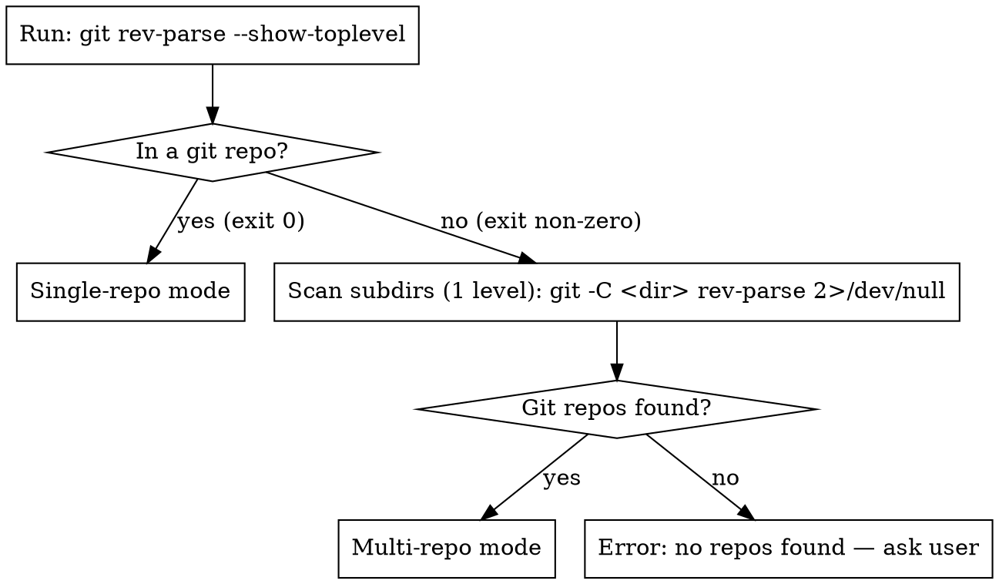

# Sandbox Implementation Environment

> **For Claude:** REQUIRED SUB-SKILL: Use superpowers:executing-plans to implement this plan task-by-task.

**Goal:** Build a Docker-based sandbox that runs Claude Code implementation sessions with full tool autonomy, no permission prompts, and no blast radius on the host OS.

**Architecture:** Three shell scripts (`sandbox.sh`, `container-run.sh`, a test script) plus a `Dockerfile` live in a new `sandbox/` directory in this repo. Two existing skill files (`brainstorming/SKILL.md`, `writing-plans/SKILL.md`) are updated with repo-detection logic and extended plan headers. `sandbox.sh` lives on the host, parses the plan file, launches the container, and appends cost records to a ledger after the container exits.

**Tech Stack:** Bash, Docker, GitHub CLI (`gh`), Claude Code CLI (`claude`), shellcheck (for script validation)

**Repo:** https://github.com/rzgholizadeh/superpowers-tailored
**Base Branch:** main
**Feature Branch:** feat/2026-04-20-sandbox-system

---

## Task 1: Add plan placement rule to brainstorming/SKILL.md

**Files:**
- Modify: `skills/brainstorming/SKILL.md`

The brainstorming skill currently has no logic for where to save plans in multi-repo projects. Add a "Plan Placement" section and update checklist item 5.

**Step 1: Read the current file**

Run: `cat -n skills/brainstorming/SKILL.md`

Locate the checklist (lines ~24-31) and the "After the Design > Documentation" section (~lines 80-86).

**Step 2: Update checklist item 5**

Find:
```
5. **Write design doc** — save to `docs/plans/YYYY-MM-DD-<topic>-design.md` and commit
```

Replace with:
```
5. **Detect repo context** — run plan placement detection (see ## Plan Placement below)
6. **Write design doc** — save to `docs/plans/YYYY-MM-DD-<topic>-design.md` inside the correct repo and commit
```

Renumber item 6 to 7.

**Step 3: Add Plan Placement section**

Insert the following new section immediately before `## After the Design`:

````markdown
## Plan Placement

Run this detection BEFORE saving any plan or design doc:



**Iron law:** A plan for repo X is ALWAYS saved inside repo X. Never at the root, never inside another repo.

**In multi-repo mode:** only create plans for repos the feature actually touches. Do not create empty plans for uninvolved repos.
````

**Step 4: Verify the file looks correct**

Run: `grep -n "Plan Placement\|Detect repo\|Iron law" skills/brainstorming/SKILL.md`

Expected: all three strings appear, in order.

**Step 5: Commit**

```bash
git add skills/brainstorming/SKILL.md
git commit -m "feat: add multi-repo plan placement rule to brainstorming skill"
```

---

## Task 2: Add sandbox header fields to writing-plans/SKILL.md

**Files:**
- Modify: `skills/writing-plans/SKILL.md`

The plan header template needs three new fields so `sandbox.sh` can parse them without any git context on the host.

**Step 1: Read the current header template**

Run: `grep -n "Tech Stack\|Repo\|Base Branch\|Feature Branch" skills/writing-plans/SKILL.md`

Expected: only `Tech Stack` appears (the others don't exist yet).

**Step 2: Replace the header template block**

Find the block:
```markdown
**Tech Stack:** [Key technologies/libraries]

---
```

Replace with:
```markdown
**Tech Stack:** [Key technologies/libraries]
**Repo:** [output of: git remote get-url origin]
**Base Branch:** [output of: git symbolic-ref refs/remotes/origin/HEAD | sed 's@^refs/remotes/origin/@@' — fallback: main]
**Feature Branch:** feat/[YYYY-MM-DD-<topic>] (derived from plan filename, created by container not planner)

---
```

**Step 3: Verify**

Run: `grep -n "Repo:\|Base Branch:\|Feature Branch:" skills/writing-plans/SKILL.md`

Expected: all three lines appear in the header template block.

**Step 4: Commit**

```bash
git add skills/writing-plans/SKILL.md
git commit -m "feat: add Repo, Base Branch, Feature Branch fields to plan header template"
```

---

## Task 3: Create Dockerfile

**Files:**
- Create: `sandbox/Dockerfile`

**Step 1: Verify sandbox/ directory does not exist yet**

Run: `ls sandbox/ 2>/dev/null || echo "not found"`

Expected: `not found`

**Step 2: Create the Dockerfile**

Create `sandbox/Dockerfile`:

```dockerfile
FROM ubuntu:24.04

ENV DEBIAN_FRONTEND=noninteractive

RUN apt-get update && apt-get install -y \
    curl \
    git \
    sudo \
    unzip \
    build-essential \
    ca-certificates \
    && rm -rf /var/lib/apt/lists/*

# Node.js 20 (required for Claude Code CLI)
RUN curl -fsSL https://deb.nodesource.com/setup_20.x | bash - \
    && apt-get install -y nodejs \
    && rm -rf /var/lib/apt/lists/*

# GitHub CLI
RUN curl -fsSL https://cli.github.com/packages/githubcli-archive-keyring.gpg \
    | dd of=/usr/share/keyrings/githubcli-archive-keyring.gpg && \
    echo "deb [arch=$(dpkg --print-architecture) signed-by=/usr/share/keyrings/githubcli-archive-keyring.gpg] https://cli.github.com/packages stable main" \
    | tee /etc/apt/sources.list.d/github-cli.list > /dev/null && \
    apt-get update && apt-get install -y gh && \
    rm -rf /var/lib/apt/lists/*

# Claude Code CLI
RUN npm install -g @anthropic-ai/claude-code

# Create workspace dir
RUN mkdir -p /workspace /logs

COPY container-run.sh /usr/local/bin/container-run.sh
RUN chmod +x /usr/local/bin/container-run.sh

ENTRYPOINT ["/usr/local/bin/container-run.sh"]
```

**Step 3: Verify the file exists**

Run: `cat sandbox/Dockerfile | grep "FROM\|claude-code\|container-run"`

Expected: all three strings appear.

**Step 4: Commit**

```bash
git add sandbox/Dockerfile
git commit -m "feat: add sandbox Dockerfile"
```

---

## Task 4: Create container-run.sh

**Files:**
- Create: `sandbox/container-run.sh`

This is the entrypoint that runs inside the container. It authenticates, clones, branches, reads the README, runs Claude, and creates the PR.

**Step 1: Create the script**

Create `sandbox/container-run.sh`:

```bash
#!/usr/bin/env bash
set -euo pipefail

# Required env vars (passed by sandbox.sh)
: "${ANTHROPIC_API_KEY:?ANTHROPIC_API_KEY is required}"
: "${GITHUB_TOKEN:?GITHUB_TOKEN is required}"
: "${REPO_URL:?REPO_URL is required}"
: "${BASE_BRANCH:?BASE_BRANCH is required}"
: "${FEATURE_BRANCH:?FEATURE_BRANCH is required}"
: "${PLAN_PATH:?PLAN_PATH is required}"

LOG=/logs/session.log

log() { echo "[container] $*" | tee -a "$LOG"; }

log "Starting sandbox container"
log "Repo: $REPO_URL"
log "Branch: $FEATURE_BRANCH"
log "Plan: $PLAN_PATH"

# Authenticate GitHub CLI
log "Authenticating GitHub CLI..."
echo "$GITHUB_TOKEN" | gh auth login --with-token

# Configure git identity
git config --global user.email "sandbox@claude-agent"
git config --global user.name "Claude Sandbox"

# Clone repo
log "Cloning $REPO_URL..."
git clone "$REPO_URL" /workspace
cd /workspace

# Checkout base branch and create feature branch
git checkout "$BASE_BRANCH"
git checkout -b "$FEATURE_BRANCH"
log "On branch $FEATURE_BRANCH"

# Run Claude: read README, install deps, execute plan
log "Starting Claude Code..."
claude --dangerously-skip-permissions \
  -p "Read the README first. Install any missing OS-level or project-level dependencies. Then use superpowers:executing-plans on $PLAN_PATH." \
  2>&1 | tee -a "$LOG"

# Create PR
log "Creating pull request..."
PLAN_TITLE=$(head -1 "$PLAN_PATH" | sed 's/^# //')
PR_URL=$(gh pr create \
  --base "$BASE_BRANCH" \
  --head "$FEATURE_BRANCH" \
  --title "$PLAN_TITLE" \
  --body "Implemented by Claude sandbox agent.

Plan: \`$PLAN_PATH\`
Feature branch: \`$FEATURE_BRANCH\`" \
  2>&1 | grep "https://")

log "DONE: PR created at $PR_URL"
echo "SANDBOX_PR_URL=$PR_URL" >> "$LOG"
```

**Step 2: Verify syntax**

Run: `bash -n sandbox/container-run.sh`

Expected: exits 0 with no output (syntax OK).

**Step 3: Run shellcheck**

Run: `shellcheck sandbox/container-run.sh`

Expected: exits 0. If shellcheck is not installed: `sudo apt-get install -y shellcheck` then re-run.

Fix any issues shellcheck reports before proceeding.

**Step 4: Commit**

```bash
git add sandbox/container-run.sh
git commit -m "feat: add container-run.sh entrypoint"
```

---

## Task 5: Create sandbox.sh with header parsing (TDD)

**Files:**
- Create: `tests/test_sandbox_parsing.sh`
- Create: `sandbox/sandbox.sh`

The header parsing logic in `sandbox.sh` is the most testable part. Write the test first.

**Step 1: Create a fixture plan file for testing**

Create `tests/fixtures/test-plan.md`:

```markdown
# Test Feature Implementation Plan

> **For Claude:** REQUIRED SUB-SKILL: Use superpowers:executing-plans

**Goal:** Test goal sentence
**Architecture:** Test architecture
**Tech Stack:** bash
**Repo:** https://github.com/testuser/testrepo.git
**Base Branch:** main
**Feature Branch:** feat/2026-04-20-test-feature

---

### Task 1: Do something
```

**Step 2: Write the failing test**

Create `tests/test_sandbox_parsing.sh`:

```bash
#!/usr/bin/env bash
set -euo pipefail

FIXTURE="$(dirname "$0")/fixtures/test-plan.md"
SANDBOX="$(dirname "$0")/../sandbox/sandbox.sh"

# Source only the parsing functions from sandbox.sh (not the full script)
# We test by calling parse_plan directly
parse_plan() {
  local plan_file="$1"
  REPO_URL=$(grep "^\*\*Repo:" "$plan_file" | awk '{print $2}')
  BASE_BRANCH=$(grep "^\*\*Base Branch:" "$plan_file" | awk '{print $3}')
  FEATURE_BRANCH=$(grep "^\*\*Feature Branch:" "$plan_file" | awk '{print $3}')
  TOPIC=$(basename "$plan_file" .md)
}

pass=0
fail=0

check() {
  local desc="$1" expected="$2" actual="$3"
  if [ "$expected" = "$actual" ]; then
    echo "  PASS: $desc"
    ((pass++))
  else
    echo "  FAIL: $desc"
    echo "    expected: $expected"
    echo "    actual:   $actual"
    ((fail++))
  fi
}

echo "=== sandbox header parsing ==="
parse_plan "$FIXTURE"

check "REPO_URL"       "https://github.com/testuser/testrepo.git" "$REPO_URL"
check "BASE_BRANCH"    "main"                                       "$BASE_BRANCH"
check "FEATURE_BRANCH" "feat/2026-04-20-test-feature"               "$FEATURE_BRANCH"
check "TOPIC"          "test-plan"                                   "$TOPIC"

echo ""
echo "Results: $pass passed, $fail failed"
[ "$fail" -eq 0 ]
```

**Step 3: Run test — expect PASS (parsing logic is self-contained in the test)**

Run: `bash tests/test_sandbox_parsing.sh`

Expected:
```
=== sandbox header parsing ===
  PASS: REPO_URL
  PASS: BASE_BRANCH
  PASS: FEATURE_BRANCH
  PASS: TOPIC

Results: 4 passed, 0 failed
```

(The parsing logic is embedded in the test itself to verify correctness. The same logic will be copied into `sandbox.sh`.)

**Step 4: Create sandbox.sh**

Create `sandbox/sandbox.sh`:

```bash
#!/usr/bin/env bash
set -euo pipefail

usage() {
  echo "Usage: sandbox.sh <path-to-plan.md>"
  echo ""
  echo "Required env vars:"
  echo "  ANTHROPIC_API_KEY"
  echo "  GITHUB_TOKEN"
  exit 1
}

[ $# -eq 1 ] || usage
[ -f "$1" ] || { echo "Error: plan file not found: $1"; exit 1; }
[ -n "${ANTHROPIC_API_KEY:-}" ] || { echo "Error: ANTHROPIC_API_KEY not set"; exit 1; }
[ -n "${GITHUB_TOKEN:-}" ] || { echo "Error: GITHUB_TOKEN not set"; exit 1; }

PLAN_FILE="$(realpath "$1")"

# Parse plan header
REPO_URL=$(grep "^\*\*Repo:" "$PLAN_FILE" | awk '{print $2}')
BASE_BRANCH=$(grep "^\*\*Base Branch:" "$PLAN_FILE" | awk '{print $3}')
FEATURE_BRANCH=$(grep "^\*\*Feature Branch:" "$PLAN_FILE" | awk '{print $3}')
TOPIC=$(basename "$PLAN_FILE" .md)

[ -n "$REPO_URL" ]       || { echo "Error: **Repo:** field missing from plan header"; exit 1; }
[ -n "$BASE_BRANCH" ]    || { echo "Error: **Base Branch:** field missing from plan header"; exit 1; }
[ -n "$FEATURE_BRANCH" ] || { echo "Error: **Feature Branch:** field missing from plan header"; exit 1; }

# Derive plan path relative to its repo root
PLAN_REPO_ROOT=$(git -C "$(dirname "$PLAN_FILE")" rev-parse --show-toplevel 2>/dev/null \
  || { echo "Error: plan file is not inside a git repo"; exit 1; })
PLAN_PATH="${PLAN_FILE#$PLAN_REPO_ROOT/}"

# Create log file
LOG_DIR="$HOME/.claude/sandbox-logs"
mkdir -p "$LOG_DIR"
LOG_FILE="$LOG_DIR/$(date +%Y%m%dT%H%M%S)-$TOPIC.log"
touch "$LOG_FILE"

echo "Starting sandbox"
echo "  Plan:    $TOPIC"
echo "  Repo:    $REPO_URL"
echo "  Branch:  $FEATURE_BRANCH"
echo "  Log:     $LOG_FILE"
echo ""
echo "Tail logs with:"
echo "  tail -f $LOG_FILE"
echo ""

# Run container
docker run --rm \
  -e ANTHROPIC_API_KEY="$ANTHROPIC_API_KEY" \
  -e GITHUB_TOKEN="$GITHUB_TOKEN" \
  -e REPO_URL="$REPO_URL" \
  -e BASE_BRANCH="$BASE_BRANCH" \
  -e FEATURE_BRANCH="$FEATURE_BRANCH" \
  -e PLAN_PATH="$PLAN_PATH" \
  -v "$LOG_FILE":/logs/session.log \
  claude-sandbox:latest

# Extract results from log
COST=$(grep -oP 'Total cost: \$\K[\d.]+' "$LOG_FILE" 2>/dev/null | tail -1 || echo "unknown")
PR_URL=$(grep -oP 'SANDBOX_PR_URL=\K\S+' "$LOG_FILE" 2>/dev/null | tail -1 || echo "unknown")

# Append to cost ledger
LEDGER="$HOME/.claude/sandbox-costs.csv"
if [ ! -f "$LEDGER" ]; then
  echo "timestamp,plan,repo,feature_branch,cost_usd,pr_url" > "$LEDGER"
fi
echo "$(date -u +%Y-%m-%dT%H:%M:%SZ),$TOPIC,$REPO_URL,$FEATURE_BRANCH,$COST,$PR_URL" >> "$LEDGER"

echo ""
echo "DONE: $PR_URL | Cost: \$$COST"
```

**Step 5: Verify syntax and shellcheck**

Run:
```bash
bash -n sandbox/sandbox.sh
shellcheck sandbox/sandbox.sh
```

Expected: both exit 0. Fix any shellcheck warnings before proceeding.

**Step 6: Verify test still passes**

Run: `bash tests/test_sandbox_parsing.sh`

Expected: 4 passed, 0 failed.

**Step 7: Make scripts executable**

Run:
```bash
chmod +x sandbox/sandbox.sh sandbox/container-run.sh tests/test_sandbox_parsing.sh
```

**Step 8: Commit**

```bash
git add sandbox/sandbox.sh tests/test_sandbox_parsing.sh tests/fixtures/test-plan.md
git commit -m "feat: add sandbox.sh launcher and header parsing tests"
```

---

## Task 6: Build and verify Docker image

**Files:**
- Read: `sandbox/Dockerfile`

**Step 1: Build the image**

Run: `docker build -t claude-sandbox:latest sandbox/`

Expected: exits 0. Output ends with `Successfully tagged claude-sandbox:latest` or similar.

If build fails, read the error carefully — most likely a network issue pulling a package. Fix the Dockerfile and retry.

**Step 2: Verify key tools exist inside the image**

Run:
```bash
docker run --rm claude-sandbox:latest bash -c "
  echo '--- git ---' && git --version &&
  echo '--- gh ---' && gh --version &&
  echo '--- node ---' && node --version &&
  echo '--- claude ---' && claude --version &&
  echo '--- entrypoint ---' && ls -la /usr/local/bin/container-run.sh
"
```

Expected: all five commands produce output (versions or file listing). No `command not found` errors.

**Step 3: Commit**

```bash
# No files to add — just document the build succeeded
git commit --allow-empty -m "chore: docker image builds and passes tool verification"
```

---

## Task 7: Install sandbox.sh globally via symlink

**Files:**
- No files created — this is a host environment setup step

`sandbox.sh` lives in the superpowers-tailored repo but must be callable from any project directory without a full path.

**Step 1: Ensure ~/.local/bin exists and is on PATH**

Run:
```bash
mkdir -p ~/.local/bin
echo $PATH | grep -q "$HOME/.local/bin" && echo "already on PATH" || echo "NOT on PATH"
```

If NOT on PATH: add `export PATH="$HOME/.local/bin:$PATH"` to your `~/.bashrc` or `~/.zshrc`, then reload:
```bash
source ~/.bashrc  # or source ~/.zshrc
```

**Step 2: Create symlink**

Run:
```bash
ln -sf "$(pwd)/sandbox/sandbox.sh" ~/.local/bin/sandbox
```

This must be run from the root of the superpowers-tailored repo. The symlink points to the repo copy, so any future updates to `sandbox.sh` are picked up automatically — no reinstall needed.

**Step 3: Verify**

Run:
```bash
which sandbox
sandbox --help 2>&1 | head -5 || sandbox 2>&1 | head -5
```

Expected: `which sandbox` prints `~/.local/bin/sandbox`. The second command prints usage (exits with error is fine — no plan arg was passed).

**Step 4: Commit a note about the install step**

```bash
git commit --allow-empty -m "chore: sandbox.sh symlinked to ~/.local/bin/sandbox"
```

---

## Task 8: Add usage documentation and final commit

**Files:**
- Create: `sandbox/README.md`

**Step 1: Create sandbox/README.md**

```markdown
# Claude Sandbox

Runs Claude Code implementation sessions in an isolated Docker container — full tool autonomy, no permission prompts, no blast radius on the host OS.

## Prerequisites

- Docker running locally
- `ANTHROPIC_API_KEY` set in your shell (Anthropic API key)
- `GITHUB_TOKEN` set in your shell (fine-grained token: repo contents read/write + pull requests write)

## Build the image (once)

```bash
docker build -t claude-sandbox:latest sandbox/
```

## Usage

```bash
# Single repo
sandbox/sandbox.sh docs/plans/2026-04-20-my-feature.md

# Multi-repo (run in parallel)
sandbox/sandbox.sh backend/docs/plans/2026-04-20-auth.md &
sandbox/sandbox.sh frontend/docs/plans/2026-04-20-auth-ui.md &
wait
```

## Watch logs

```bash
tail -f ~/.claude/sandbox-logs/<timestamp>-<topic>.log
```

## Review costs

```bash
cat ~/.claude/sandbox-costs.csv

# Sum all costs
awk -F',' 'NR>1 {sum += $5} END {print "Total: $" sum}' ~/.claude/sandbox-costs.csv
```

## How it works

1. `sandbox.sh` parses the plan header (Repo, Base Branch, Feature Branch)
2. Starts a Docker container with only `ANTHROPIC_API_KEY`, `GITHUB_TOKEN`, and a write-only log file mount
3. Container clones the repo, creates the feature branch, reads the README, installs deps, runs `executing-plans`
4. Container creates a PR and exits
5. `sandbox.sh` parses the log, appends a cost record to `~/.claude/sandbox-costs.csv`

## Plan header requirements

Plans must include these fields (added automatically by `writing-plans` skill):

```
**Repo:** https://github.com/user/repo.git
**Base Branch:** main
**Feature Branch:** feat/YYYY-MM-DD-topic
```
```

**Step 2: Verify file exists**

Run: `wc -l sandbox/README.md`

Expected: > 40 lines.

**Step 3: Final commit**

```bash
git add sandbox/README.md
git commit -m "docs: add sandbox usage documentation"
```

---

## Verification Checklist

Before considering this complete:

- [ ] `bash tests/test_sandbox_parsing.sh` → 4 passed, 0 failed
- [ ] `shellcheck sandbox/sandbox.sh sandbox/container-run.sh` → 0 errors
- [ ] `docker build -t claude-sandbox:latest sandbox/` → exits 0
- [ ] `docker run --rm claude-sandbox:latest bash -c "claude --version"` → prints version
- [ ] `which sandbox` → prints `~/.local/bin/sandbox`
- [ ] `git log --oneline` shows 8 commits for this feature
- [ ] `grep "Plan Placement\|Iron law" skills/brainstorming/SKILL.md` → both appear
- [ ] `grep "Feature Branch:" skills/writing-plans/SKILL.md` → appears in header template
